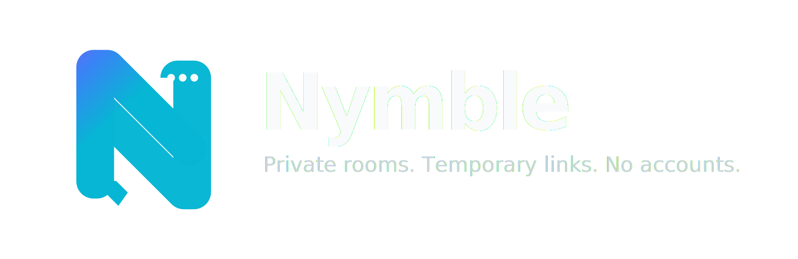

# Nymble

<p align="center">
  
</p>

**Private rooms. Temporary links. No accounts.**

Nymble is an experimental self-hosted private chat prototype. It lets you start a tiny local chat server, create a temporary public link, and invite someone with a simple room code.

No accounts. No database. No stored chat history.

> **Status:** alpha prototype  
> **Use for:** testing, learning, demos, private experiments  
> **Do not use for:** high-risk or security-critical communication

---

## Download

Download the latest alpha release here:

[Nymble v0.1.1 Alpha](../../releases/tag/v0.1.1-alpha)

Then unzip it and open the `Windows` or `Mac` folder.

```text
Windows users:
START NYMBLE.bat

Mac users:
START NYMBLE.command
```

---

## What is Nymble?

Nymble is a small self-hosted chat app designed around a simple idea:

1. One person starts Nymble.
2. Nymble creates a temporary public link.
3. The host sends that link to a friend.
4. The host creates a room code like `BLUE-FOX-42`.
5. The friend enters the code.
6. Chat starts.

Nymble is built to be easy to test with normal users while avoiding accounts, signups, databases, and paid hosting.

---

## Features

- **Room Codes**  
  Connect with short codes like `BLUE-FOX-42`.

- **Temporary Public Links**  
  Uses Cloudflare Quick Tunnel to create a temporary public `trycloudflare.com` link.

- **No Accounts**  
  No email, username, phone number, or signup flow.

- **No Database**  
  Rooms exist only in memory while the server is running.

- **No Stored Chat History**  
  Refreshing or stopping the server clears chat state.

- **Relay Privacy Mode**  
  Optional fallback mode where messages are encrypted in the browser and relayed through the host server instead of using direct peer-to-peer WebRTC.

- **Focus Chat**  
  In-page full-screen chat mode designed to work better on phones than opening a separate chat tab.

- **Windows and macOS Starters**  
  Simple double-click start scripts for non-technical testers.

---

## Quick Start

Download the latest release ZIP and choose your platform folder.

### Windows

Double-click:

```text
START NYMBLE.bat
```

### macOS

Double-click:

```text
START NYMBLE.command
```

If macOS blocks the file, right-click it and choose **Open**.

---

## How to Connect

### Different Wi-Fi / Remote Testing

1. Host opens `START NYMBLE`.
2. Nymble starts a local server.
3. Nymble creates a temporary Cloudflare public link.
4. Host sends the `trycloudflare.com` link to a friend.
5. Friend opens the link in a browser.
6. Host creates a **Room Code**.
7. Friend enters the **Room Code**.
8. Chat starts.

### Same Wi-Fi

You can use the same flow with the public link, or open the local address shown in the server window.

For non-technical users, the public link flow is usually simpler.

---

## Modes

### Room Code

The default mode.

Use this first.

```text
Host: Create Room Code
Guest: Enter Room Code
```

Best for normal testing and simple conversations.

### Relay Privacy

Fallback and privacy-focused mode.

Use this when Room Code does not connect, or when you want to avoid direct peer-to-peer connection.

In Relay Privacy mode:

- Peers do not connect directly to each other.
- Messages are encrypted in the browser.
- The host server forwards encrypted packets.
- The server still sees metadata such as timing and IP connections.

---

## Important Security Notes

Nymble is an alpha prototype. It is not a finished secure messenger.

Please do not market or use it as:

```text
anonymous
untraceable
military-grade secure
zero metadata
production-ready encrypted messenger
```

A more accurate description is:

```text
experimental self-hosted private chat prototype
```

### What Nymble does well

- No accounts
- No central database
- No stored chat history
- Temporary rooms
- Simple self-hosted flow
- Optional encrypted relay mode

### Current limitations

- Cloudflare Tunnel can see connection metadata.
- The host machine can see server activity metadata.
- WebRTC mode may expose peer network information.
- The encryption design has not been independently audited.
- Room codes can be shared or guessed if exposed.
- Browser security depends on the environment where the app is served.
- This is not designed for high-risk communication.

---

## Requirements

Users need:

```text
Node.js
```

Download Node.js here:

```text
https://nodejs.org/
```

No `npm install` is required.

---

## Project Structure

```text
Nymble/
├─ Windows/
│  ├─ START NYMBLE.bat
│  ├─ STOP NYMBLE.bat
│  ├─ server.js
│  └─ public/
│
├─ Mac/
│  ├─ START NYMBLE.command
│  ├─ STOP NYMBLE.command
│  ├─ server.js
│  └─ public/
│
└─ README.md
```

---

## Stopping Nymble

### Windows

Double-click:

```text
STOP NYMBLE.bat
```

Or close the server windows.

### macOS

Press:

```text
Control + C
```

inside the terminal window.

Or double-click:

```text
STOP NYMBLE.command
```

---

## Why Nymble Exists

Most chat apps require accounts, phone numbers, servers, or databases.

Nymble explores a different approach:

```text
temporary rooms
self-hosted access
simple codes
no stored history
no signup
```

The goal is not to replace mature secure messengers. The goal is to experiment with lightweight, self-hosted private communication that normal people can test quickly.

---

## Roadmap

Possible future improvements:

- Better mobile interface
- One-click packaged desktop app
- Built-in updater
- Stronger room approval flow
- Better relay encryption design
- Optional password-protected rooms
- Rate limits for room code attempts
- Better connection diagnostics
- Native app packaging
- Security review and threat model documentation
- Optional Tor/onion mode
- Optional Tailscale/Funnel mode

---

## Development

Run manually:

```bash
node server.js
```

Then open:

```text
http://localhost:8080
```

The app uses only Node.js built-in modules.

No database is required.

---

## Contributing

Contributions are welcome, especially around:

- UI/UX improvements
- Mobile layout
- Connection reliability
- Privacy/security review
- Documentation
- Packaging
- Testing on Windows/macOS/Linux
- Browser compatibility

Before making security claims, please document the threat model and limitations clearly.

---

## License

MIT License

---

## Disclaimer

Nymble is experimental software.

It is provided for learning, testing, and prototyping. It has not been audited and should not be used for sensitive, high-risk, or safety-critical communication.

Use at your own risk.
